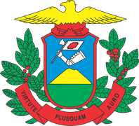

## O projeto

O **Projeto Desenvolvimento Sustentável e Inclusivo do Pantanal Norte Mato-grossense (DSIP-MT)** realiza um estudo de análise diagnóstica de ordenamento territorial e desenvolvimento regional sustentável e inclusivo do Pantanal Norte Mato-grossense. É executado pela Universidade do Estado de Mato Grosso (UNEMAT) com recursos da Superintendência do Desenvolvimento do Centro-Oeste (SUDECO), no âmbito do Convênio 984799/2025, com vigência de fevereiro de 2026 a agosto de 2027.

::: {.logos-realizacao}
  
:::

- **Coordenação geral:** Prof. Dr. Ademir Machado de Oliveira (UNEMAT)
- **Responsável técnico e manutenção deste site:** Prof. Dr. Lindomar Pegorini Daniel (UNEMAT)

## O recorte

O estudo cobre 13 municípios, definidos institucionalmente no convênio: Barão de Melgaço, Cáceres, Curvelândia, Glória D'Oeste, Itiquira, Juscimeira, Lambari D'Oeste, Mirassol D'Oeste, Nossa Senhora do Livramento, Poconé, Porto Esperidião, Rondonópolis e Santo Antônio do Leverger. Para comparação, os indicadores também são calculados para o Polo Metropolitano (Cuiabá e Várzea Grande), para os demais 126 municípios de Mato Grosso e para o estado.

## As seis dimensões

| Dimensão | Tema |
|---|---|
| D1 · PESM | Perfil econômico-produtivo setorial municipal |
| D2 · AEISM | Áreas de especial interesse socioeconômico municipal |
| D3 · PSDM | Perfil sociodemográfico municipal |
| D4 · PAM | Perfil ambiental municipal |
| D5 · PIM | Perfil da infraestrutura municipal |
| D6 · PGPM | Perfil da gestão pública municipal |

## Etapas

1. **Fase I (concluída em julho de 2026):** coleta e tratamento de bases públicas e Relatórios Parciais I das seis dimensões.
2. **Revisão de literatura (em andamento):** matriz FOFA (forças, oportunidades, fraquezas e ameaças) por área-chave. A área econômica foi concluída; as demais estão em execução.
3. **Pesquisa de campo e Parciais II:** verificação das hipóteses nos municípios.
4. **Relatórios gerais e relatórios executivos municipais** (13), com diretrizes para o desenvolvimento.
5. **Painéis e website** para divulgação dos resultados.

## Sobre este site

Este site reúne, num só lugar, os resultados que a equipe do projeto já produziu: indicadores por município, relatórios, bases de dados e a revisão de literatura. **É uma versão preliminar**, atualizada à medida que as etapas são concluídas.

- Os números vêm das bases tratadas da Fase I, congeladas em 08/07/2026, e dos pacotes entregues da revisão de literatura. Indicadores complementares (turismo, conectividade, empresas ativas, agências bancárias, homicídios, ocupação no Censo 2022 e o ISDEL) foram obtidos no [Observatório Setorial Territorial do Sebrae](https://observatorio.sebrae.com.br/) em 30/09/2026 e aparecem com o selo OST.
- Os documentos da Biblioteca são as versões de referência para citação.
- O site é gerado com [Quarto](https://quarto.org) e R a partir dos arquivos oficiais do projeto e publicado no GitHub Pages.
- Não são publicados textos integrais de artigos de terceiros, microdados com informação pessoal nem bases cuja redistribuição depende de autorização (IFDM/FIRJAN).
